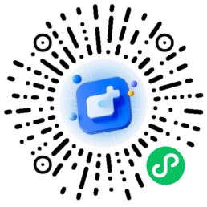
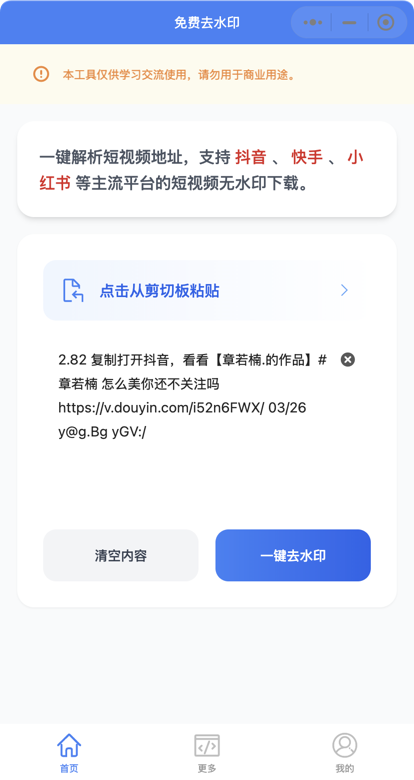
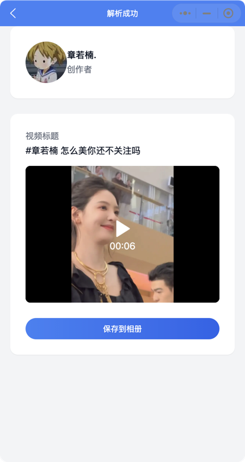

###
# simple-tool

## 项目介绍
本项目是一个短视频去水印小程序，后端采用 Golang 构建，前端使用 UniApp 开发。借助开源项目的强大功能，为用户提供便捷的短视频去水印服务。

### 技术栈
- **后端**：Golang
- **前端**：UniApp，结合 [unibest 框架](https://www.unibest.tech) 并利用 AI 辅助生成前端代码。

### 短视频解析服务
本项目的短视频解析服务使用了开源项目 [parse-video](https://github.com/wujunwei928/parse-video) 的代码，感谢该项目的开发者提供的优秀实现。

### 演示小程序

### 项目截图

